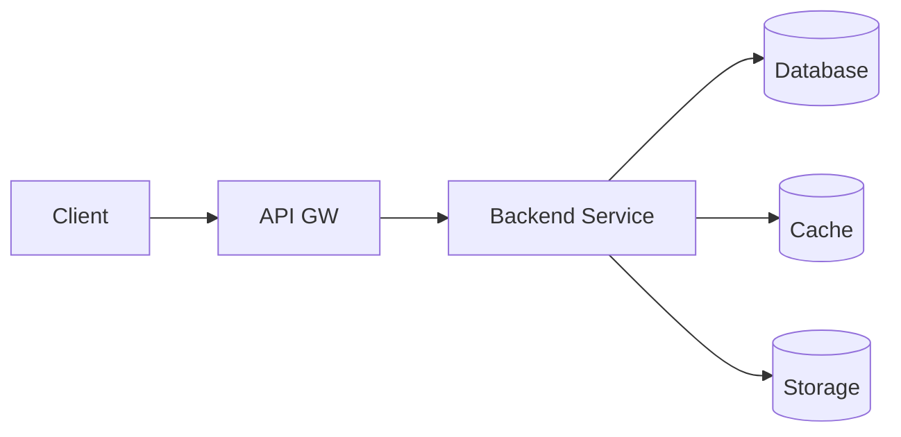
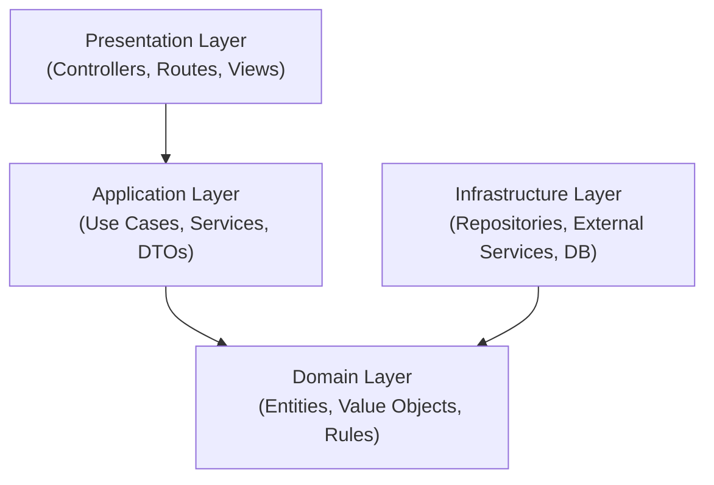
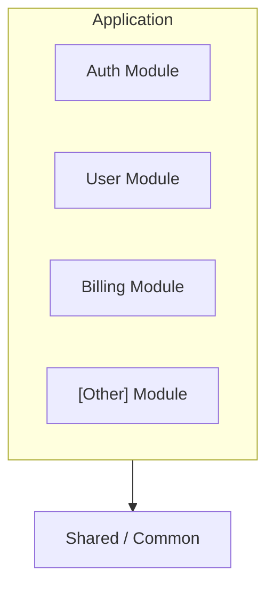
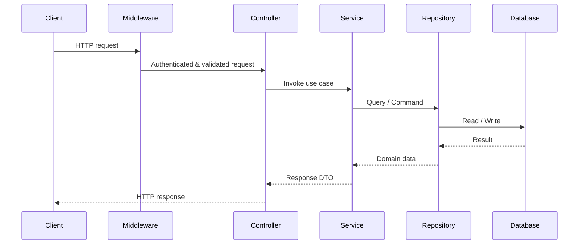
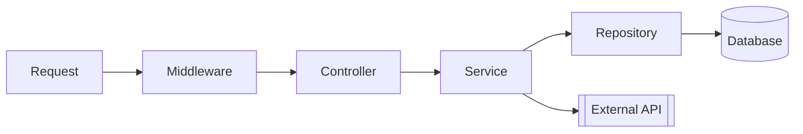

# System Architecture

This document describes the high-level architecture of the system. AI assistants should reference this to understand how components interact and where new code should be placed.

---

## Purpose & Scope

This document defines system structure, boundaries, and contracts. It SHOULD be the single source of truth for the current architecture of this system.

At project kick-off, fill in at least:

- System Overview
- Architecture Style
- Repository Layout
- Layer Architecture
- Module Structure
- Data Flow

As the system evolves, new or changed architecture concerns SHOULD be introduced via OpenSpec change proposals and reflected here when those changes are archived.

This document MUST NOT define tooling choices or versions (see `tech-stack.md`). Development philosophy (e.g., TDD) lives in `conventions.md`.

When adding diagrams to this file, prefer mermaid syntax code blocks or embedded images instead of plain ASCII art.

## System Overview

### Purpose
[Brief description of what this system does and its primary goals]

### High-Level Diagram



---

## Architecture Style

**Pattern**: [e.g., Monolith, Microservices, Modular Monolith, Serverless]

**Rationale**: [Why this architecture was chosen]

---

## Repository Layout

Describe the repository structure and where new code SHOULD be placed.

```text
[Example]

src/
├── [module_or_feature]/
│   ├── domain/            # Core business rules (no I/O)
│   ├── application/       # Use cases / orchestration
│   ├── infrastructure/    # DB/external clients/adapters
│   └── presentation/      # HTTP/CLI entrypoints
tests/
└── ...
```

---

## Layer Architecture

### Layer Diagram



### Layer Descriptions

| Layer | Responsibility | Dependencies |
|-------|----------------|--------------|
| Presentation | [e.g., Handle HTTP requests, render views] | Application |
| Application | [e.g., Orchestrate use cases, transactions] | Domain, Infrastructure |
| Domain | [e.g., Business logic, entities] | None |
| Infrastructure | [e.g., Database, external APIs, file system] | Domain |

### Dependency Rules

- [e.g., Dependencies point inward (Clean Architecture)]
- [e.g., Domain layer has no external dependencies]
- [e.g., Infrastructure implements interfaces defined in Domain]

---

## Module Structure

### Module Diagram



### Module Descriptions

| Module | Responsibility | Public Interface |
|--------|----------------|------------------|
| [Module Name] | [What it handles] | [Exported functions/classes] |
| [Module Name] | [What it handles] | [Exported functions/classes] |
| [Module Name] | [What it handles] | [Exported functions/classes] |

### Module Communication

- [e.g., Modules communicate via public interfaces only]
- [e.g., Use events for cross-module notifications]
- [e.g., Shared types defined in common module]

---

## Data Flow

### Request Flow



### Data Flow Diagram



### API Contract (if applicable)

- **API Style**: [e.g., REST, GraphQL, gRPC] (technology choice belongs in `tech-stack.md`)
- **Versioning**: [e.g., /api/v1, header-based, none]
- **Resource Naming**: [Rules for URLs/topics/service names]
- **Success Response Shape**: [High-level contract]
- **Error Response Shape**: [High-level contract]

---

## Notes for AI Assistants

When working with this architecture:

1. **Respect layer boundaries** - Don't bypass layers
2. **Follow module ownership** - Put code in the right module
3. **Use established patterns** - Match existing component structure
4. **Consider data flow** - Understand how data moves through the system
5. **Check security boundaries** - Don't expose internal details
6. **Reference existing components** - Look at similar code before creating new patterns

Also:

- Follow development philosophy and coding conventions in `conventions.md`
- Use tools, frameworks, and versions defined in `tech-stack.md`
